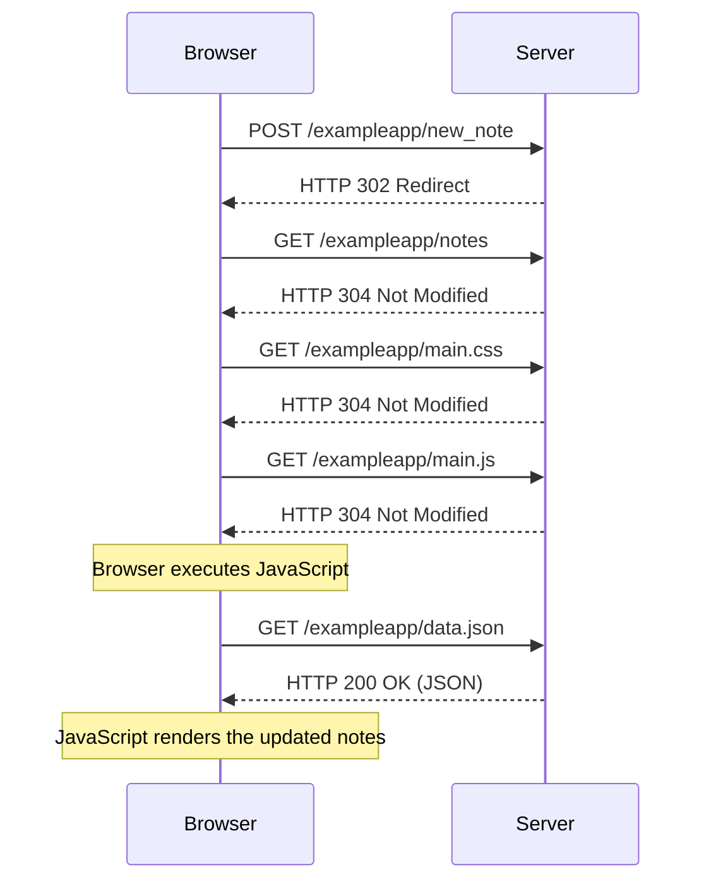

```mermaid
sequenceDiagram
    participant B as Browser
    participant S as Server

    B->>S: POST /exampleapp/new_note
    S-->>B: HTTP 302 Redirect

    B->>S: GET /exampleapp/notes
    S-->>B: HTTP 304 Not Modified

    B->>S: GET /exampleapp/main.css
    S-->>B: HTTP 304 Not Modified

    B->>S: GET /exampleapp/main.js
    S-->>B: HTTP 304 Not Modified

    Note over B: Browser executes JavaScript

    B->>S: GET /exampleapp/data.json
    S-->>B: HTTP 200 OK (JSON)

    Note over B: JavaScript renders the updated notes
```