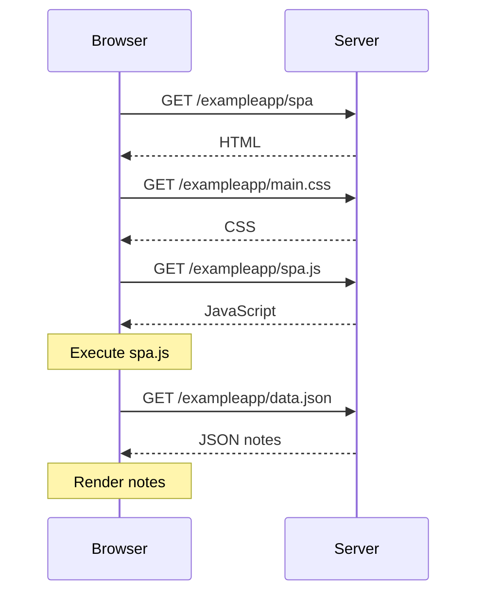

```mermaid
sequenceDiagram
    participant B as Browser
    participant S as Server
    B->>S: GET /exampleapp/spa
    S-->>B: HTML
    B->>S: GET /exampleapp/main.css
    S-->>B: CSS
    B->>S: GET /exampleapp/spa.js
    S-->>B: JavaScript
    Note over B: Execute spa.js
    B->>S: GET /exampleapp/data.json
    S-->>B: JSON notes
    Note over B: Render notes
```