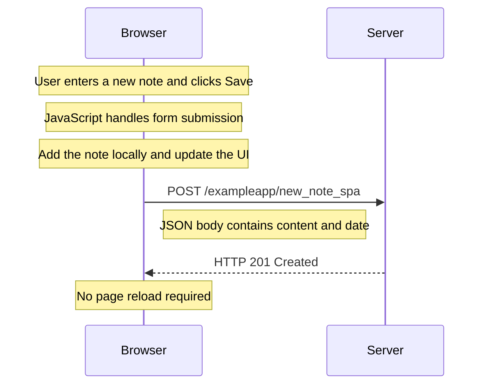

```mermaid
sequenceDiagram
    participant B as Browser
    participant S as Server

    Note over B: User enters a new note and clicks Save

    Note over B: JavaScript handles form submission

    Note over B: Add the note locally and update the UI

    B->>S: POST /exampleapp/new_note_spa
    Note right of B: JSON body contains content and date

    S-->>B: HTTP 201 Created

    Note over B: No page reload required
```